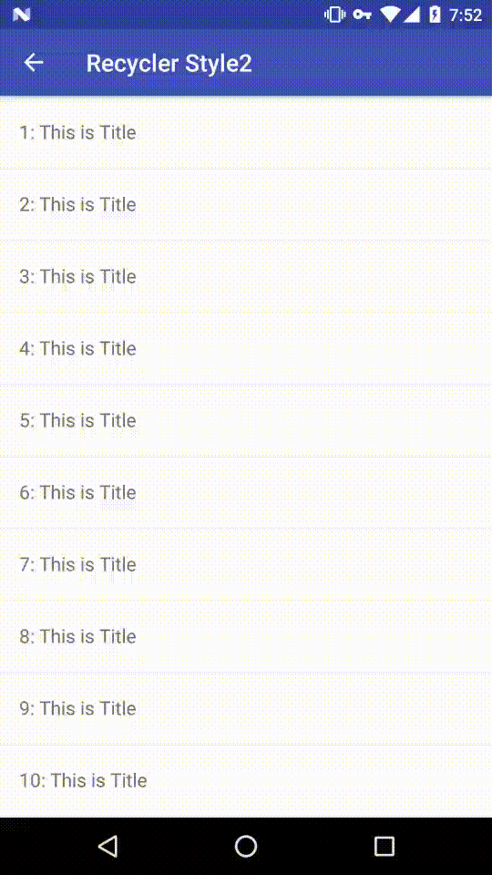

# PullRefreshLayout


PullRefreshLayout for Android,like SwipeRefreshLayout,which support pull-down to refresh and pull-up to load more data，and is very streamlined.
In principle, it supports a variety of contentview, such as: RecyclerView, ListView, Webview, Scrollview and so on. But I have only tested RecyclerView, if you are using other contentview encounter problems, please contact me or sumbit issue.
Use this library,you can make any pull-down and pull-up animation,but i only finished two style. If you have another requirements,you can contact me.

## Preview


## Gradle
Step 1. Add the JitPack repository to your build file
```
allprojects {
	repositories {
		...
		maven { url 'https://jitpack.io' }
	}
}
```
Step 2. Add the dependency
```
dependencies {
        compile 'com.github.JayFang1993:PullRefreshLayout:v1.0-beta1'
}
```

## Usage

```xml
<info.fangjie.pulltorefresh.PullRefreshLayout
    xmlns:android="http://schemas.android.com/apk/res/android"
    xmlns:PullRefreshLayout="http://schemas.android.com/apk/res-auto"
    android:layout_width="match_parent"
    android:id="@+id/pullrefreshlayout"
    android:layout_height="match_parent"
    android:background="#353739"
    PullRefreshLayout:enableload="true"
    >
  <TextView
      android:layout_width="match_parent"
      android:layout_centerVertical="true"
      android:background="#353739"
      android:id="@+id/tv_refresh_header"
      android:textColor="#ffffff"
      android:layout_height="60dp"
      android:gravity="center"
      />
  <android.support.v7.widget.RecyclerView
      android:layout_width="match_parent"
      android:layout_height="match_parent"
      android:background="#ffffff"
      android:id="@+id/recyclerview"
      />
  <TextView
      android:background="#353739"
      android:layout_width="match_parent"
      android:layout_centerVertical="true"
      android:text="上拉加载"
      android:textColor="#ffffff"
      android:id="@+id/tv_refresh_footer"
      android:layout_height="60dp"
      android:gravity="center"
      />
</info.fangjie.pulltorefresh.PullRefreshLayout>
```
PullRefreshLayout has up 3 child view.
* 3 child view: first as header view,second as content view,last as footer
* 2 child view: first as header view,second as content view,no footer
* 1 child view: only one content view

### Pull-Down
```java
pullrefreshlayout.setRefreshListener(new RefreshListener(){
    //下拉到临界值后又上滑小于临界值
  @Override public void onPullBelowTarget() {}
    //下拉超过临界值
  @Override public void onPullOverTarget() {}
    //正在刷新
  @Override public void onRefreshing() {}
    //开始下拉
  @Override public void onPullBegin() { }
    //刷新完成
  @Override public void onRefreshComplete() {}
    //拉不到临界值的复原
  @Override public void onReset() {}
    //拉的过程中的偏移值
  @Override public void onPull(int offset) {}
});

//异步数据加载完成
pullrefreshlayout.setRefresh(false);
```

### Pull-Up
similar to `Pull-Down`

## Thanks
* [liaohuqiu/android-Ultra-Pull-To-Refresh](https://github.com/liaohuqiu/android-Ultra-Pull-To-Refresh)

## Contact
* Twitter: [@JayFang1993](https://twitter.com/jayfang1993)
* Weibo:[@方杰_Jay](http://weibo.com/ncuitstudent/)
* E-Mail:[JayFang1993@gmail.com](mailto:jayfang1993@gmail.com)
* Blog:[https://fangjie.info](https://fangjie.info)


## Licence

```
Copyright 2016 JayFang1993

Licensed under the Apache License, Version 2.0 (the "License");
you may not use this file except in compliance with the License.
You may obtain a copy of the License at

   http://www.apache.org/licenses/LICENSE-2.0

Unless required by applicable law or agreed to in writing, software
distributed under the License is distributed on an "AS IS" BASIS,
WITHOUT WARRANTIES OR CONDITIONS OF ANY KIND, either express or implied.
See the License for the specific language governing permissions and
limitations under the License.
```


